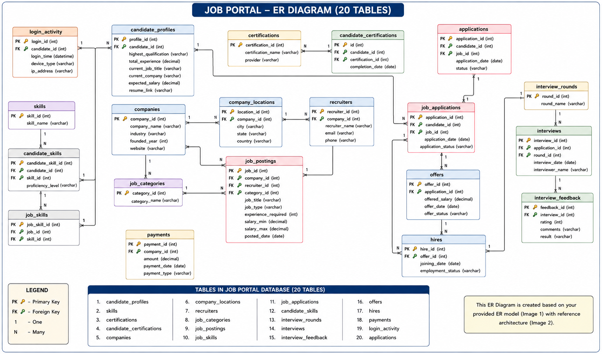

# Job Recruitment Management System – SQL Project

## 📌 Project Overview

The **Job Recruitment Management System** is a SQL-based database project designed to manage and analyze the recruitment process.

The database stores information related to companies, recruiters, job postings, candidates' profiles and skills, job applications, interviews, interview feedback, offers, hires, certifications, payments, and login activity.

The project also includes an **Entity Relationship (ER) Diagram** created using dbdiagram.io to represent the structure and relationships between the tables.

---

## 🎯 Project Objectives

- Manage job postings created by companies.
- Store recruiter and company information.
- Maintain candidate profile, skills, and certification details.
- Track job applications and their statuses.
- Manage interview rounds and interview details.
- Store interview feedback and results.
- Track job offers and hiring information.
- Record company payments and candidate login activity.
- Practice SQL queries using a relational database.

---

## 🗂️ Database Structure

The project contains the following tables:

| # | Table | Purpose |
|---|---|---|
| 1 | `candidate_profiles` | Stores candidate qualification, experience, job title, salary expectation, and resume details |
| 2 | `skills` | Stores available technical/professional skills |
| 3 | `certifications` | Stores certification names and providers |
| 4 | `candidate_certifications` | Maps candidates with their certifications |
| 5 | `companies` | Stores company information |
| 6 | `company_locations` | Stores company location details |
| 7 | `recruiters` | Stores recruiter details for each company |
| 8 | `job_categories` | Stores job categories such as Data Science, SQL Development, etc. |
| 9 | `job_postings` | Stores job title, type, experience, salary range, and posting date |
| 10 | `job_skills` | Maps jobs with required skills |
| 11 | `job_applications` | Tracks candidate applications and application status |
| 12 | `candidate_skills` | Maps candidates with their skills and proficiency |
| 13 | `interview_rounds` | Stores different interview rounds |
| 14 | `interviews` | Stores interview date, round, application, and interviewer details |
| 15 | `interview_feedback` | Stores interview ratings, comments, and results |
| 16 | `offers` | Stores job offer details and offered salary |
| 17 | `hires` | Stores joining date and employment status |
| 18 | `payments` | Stores company payment information |
| 19 | `login_activity` | Stores candidate login activity, device type, and IP address |
| 20 | `applications` | Stores application records with application status |

---

## 🔗 Key Relationships

The main relationships in the database are:

- `companies` → `company_locations`
- `companies` → `recruiters`
- `companies` → `job_postings`
- `recruiters` → `job_postings`
- `job_categories` → `job_postings`
- `job_postings` → `job_skills`
- `skills` → `job_skills`
- `job_postings` → `job_applications`
- `certifications` → `candidate_certifications`
- `skills` → `candidate_skills`
- `job_applications` → `interviews`
- `interview_rounds` → `interviews`
- `interviews` → `interview_feedback`
- `job_applications` → `offers`
- `offers` → `hires`
- `companies` → `payments`

The many-to-many relationships between jobs and skills, and between candidates and skills, are handled using mapping tables such as `job_skills` and `candidate_skills`.

---

## 🧩 ER Diagram

The ER diagram was designed using **dbdiagram.io**.

> Upload the ER diagram image to the same GitHub repository and keep it as `ER_Diagram.png`.



---

## 🛠️ Technologies Used

- **Database:** MySQL
- **Query Language:** SQL
- **ER Diagram:** dbdiagram.io
- **Version Control:** Git & GitHub

---

## 📊 Dataset

The database contains sample recruitment data covering:

- 100 job postings
- Multiple companies and recruiters
- Multiple job categories
- Technical skills such as Python, SQL, Excel, Power BI, Tableau, Machine Learning, Pandas, NumPy, etc.
- Candidate certifications
- Job applications with different statuses
- Interview records
- Offers and hiring records
- Company payment records
- Candidate login activity

The sample data is suitable for practicing filtering, aggregation, grouping, joins, subqueries, and other SQL concepts.

---

## 💡 SQL Concepts Practiced

This project can be used to practice:

- `SELECT`
- `WHERE`
- `DISTINCT`
- `ORDER BY`
- `GROUP BY`
- `HAVING`
- Aggregate functions
  - `COUNT()`
  - `SUM()`
  - `AVG()`
  - `MIN()`
  - `MAX()`
- `INNER JOIN`
- `LEFT JOIN`
- Multiple table joins
- Subqueries
- Conditional filtering
- Date-based analysis
- Salary analysis
- Application status analysis
- Interview and hiring analysis

---

## 🔍 Example Business Questions

Some questions that can be answered using this database:

1. Which companies have posted the highest number of jobs?
2. What are the most common job categories?
3. What is the average salary offered for different job roles?
4. Which skills are most frequently required in job postings?
5. How many applications are in each application status?
6. Which companies have the highest number of recruiters?
7. What is the average expected salary of candidates?
8. Which candidates have specific technical skills?
9. How many candidates were shortlisted, rejected, or selected?
10. What is the average offered salary?
11. Which job categories have the highest salary range?
12. How many interviews were conducted for different interview rounds?
13. Which companies have the highest payment amounts?
14. What devices are commonly used by candidates to log in?
15. Which certifications are most commonly associated with candidates?

---

## 📁 Suggested Repository Structure

```text
Job-Recruitment-SQL-Project/
│
├── README.md
├── job_recruitment.sql
└── ER_Diagram.png
```

---

## 🚀 How to Run the Project

### 1. Create the database

```sql
CREATE DATABASE job_portal;
USE job_portal;
```

### 2. Create the tables

Run the `CREATE TABLE` statements in the SQL file.

### 3. Insert the sample data

Run the `INSERT INTO` statements after creating the required tables.

### 4. Run SQL queries

Use MySQL Workbench, MySQL CLI, or another MySQL-compatible environment to execute analytical queries on the database.

---

## 📌 Note

The ER diagram reflects the tables and relationships used in this project. The current schema contains both `job_applications` and `applications` as separate tables because both structures are present in the project data.

Candidate-related fields such as `candidate_id` are used across several tables, while a separate `candidates` master table is not shown in the current ER diagram.

---

## 👩‍💻 Author

**Thennarasu**

SQL / Data Analytics Project
